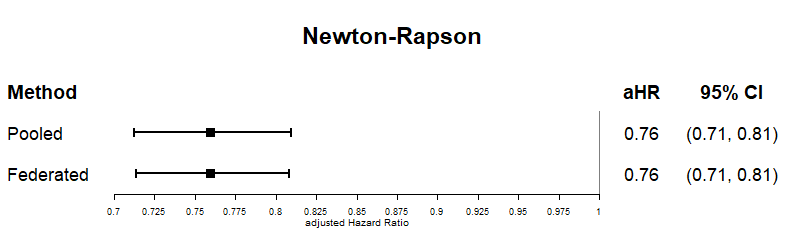
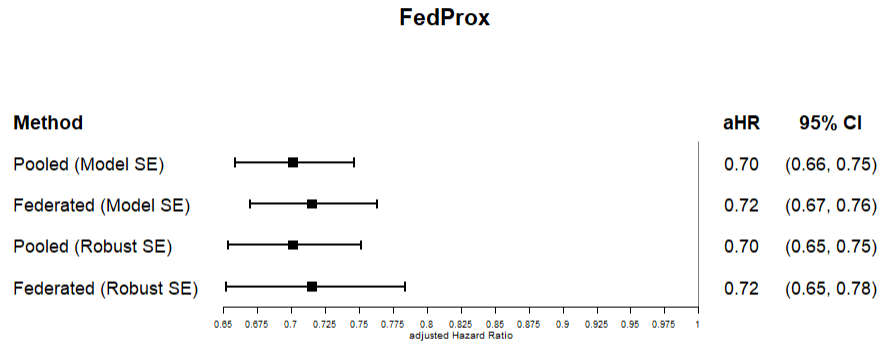

# Federated Target Trial Emulation Simulation

## About this project
I created this simulation with dummy data to follow the paper *"Federated target trial emulation using distributed observational data for treatment effect estimation"*. 

## What I did
* **Heterogeneous Data:** Since real-world hospitals have different patient data, I generated the dummy data to have different covariate distributions for each institution.
* **Federated Learning:** The institutions only share their `score` and `hessian` values to update the models. Raw data is not shared.
* **IPTW & Models:** I used a logistic regression model to get propensity scores, applied **IPTW** (Inverse Probability of Treatment Weighting), and then fitted a Cox regression model.
* **Algorithm Comparison:** I tested two different algorithms to update the models:
  * `FedProx`: The method used in the original paper.
  * `Newton-Raphson`: The algorithm I applied for this simulation.

## Result
Based on the simulation, the **Newton-Raphson** algorithm gave hazard estimates that are slightly closer to the pooled data results compared to the FedProx method.

### 1. Newton-Raphson Result
In this result, the "Federated" method means I used the **Newton-Raphson algorithm** for both propensity score estimation and Cox regression.

### 2. FedProx Result (Paper's Original Method)
Here, the "Federated" method means I used the **FedProx algorithm** (which was used in the original paper) for both propensity score estimation and Cox regression. Also, I calculated and visualized the **Robust SE (Standard Error)** along with the basic model SE for this FedProx result.

## Files in this repository
* `newton_raphson.R` : Simulation and Cox regression using the Newton-Raphson algorithm.
* `fedprox.R` : Simulation and Cox regression using the FedProx algorithm.
